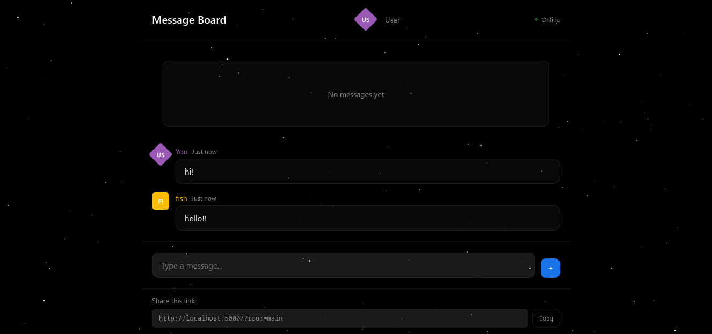

# 🚀 Cosmic Message Board

A sleek, real-time messaging app that lets you chat with friends instantly. Think of it as a **super-fast, private chat room** that you can spin up in seconds - perfect for quick conversations, sharing links, or just having fun with friends!



## ✨ Features

### 🌌 **Choose Your Vibe**
- **Normal Mode**: Clean, minimalist black interface
- **Cosmic Mode**: Beautiful starry background with glass-morphism effects

### 👤 **Personalize Your Profile**
- **Custom Name**: Set your display name
- **12 Unique Colors**: Pick your favorite color
- **Avatar Shapes**: Choose between square, circle, or diamond avatar

### ⚡ **Fast & Smooth**
- **Real-time updates** - Messages appear instantly
- **No glitches** - Smooth animations and transitions
- **No sign-up** - Just share a link and start chatting

### 🔗 **Easy Sharing**
- **One-click sharing** with bore.pub
- **No complicated setup** - Works anywhere
- **Private rooms** - Each link creates a unique chat space

## 🚀 Quick Start

### Prerequisites
- **Python 3.7+**
- **Rust & Cargo** (for bore.pub - auto-installed if needed)

### Installation & Run

1. **Get the code** (save these files in a folder):
   - `server.py` (normal version)
   - `server_fancy.py` (cosmic version)
   - `run.sh` (launcher script)

2. **Make it executable**:
   ```bash
   chmod +x run.sh
   ```

3. **Run it**:
   ```bash
   ./run.sh
   ```

4. **Follow the prompts**:
   - Choose your version (normal or cosmic)
   - Let it install everything automatically
   - Share the link that appears!

## 📖 How It Works

### For You (Running the Server):
1. Run the script
2. Choose your preferred version
3. Get a public URL (e.g., `https://abc123.bore.pub`)
4. Share that URL with friends

### For Your Friends:
1. Click the link you shared
2. Choose a name (optional)
3. Start chatting!

### ✨ Pro Tips:
- **Change your name/color** anytime by clicking your avatar
- **Multiple rooms**: Add `?room=yourroomname` to the URL for separate chats
- **Messages auto-save** - won't disappear on refresh
- **Works on mobile** - responsive design looks great anywhere

## 🛠️ Technical Stuff (For Nerds)

### What's Happening Under the Hood:
- **Backend**: Python Flask server
- **Frontend**: Single HTML file with vanilla JavaScript
- **Tunneling**: bore.pub creates secure tunnels
- **Storage**: In-memory (resets on server restart)

### File Structure:
```
cosmic-message-board/
├── server.py          # Normal version (no stars)
├── server_fancy.py    # Cosmic version (with stars)
└── run.sh            # Launcher script
```

### Manual Setup (if you want):
```bash
# Create virtual environment
python3 -m venv venv
source venv/bin/activate

# Install dependencies
pip install flask flask-cors

# Install bore.pub (for sharing)
cargo install bore-cli

# Run server
python server_fancy.py  # or server.py

# In another terminal, create tunnel:
bore local 5000 --to bore.pub
```

## ❓ FAQ

### Q: Is this secure?
**A**: Messages are encrypted in transit via bore.pub's secure tunnel. However, anyone with the link can join the chat.

### Q: Do messages save forever?
**A**: No, messages are stored in memory and disappear when the server stops. Perfect for temporary conversations!

### Q: Can I use this on my phone?
**A**: Yes! The interface is fully responsive and works great on mobile browsers.

### Q: How many people can join?
**A**: Technically unlimited, but performance is best with 2-20 people.

### Q: Is this free?
**A**: 100% free! No accounts, no payments, no tracking.

## 🎯 Use Cases

### Perfect For:
- **Quick team huddles** - Faster than setting up a Zoom
- **Gaming sessions** - Chat while playing games
- **Event coordination** - Share links and updates
- **Study groups** - Quick question/answer sessions
- **Family chats** - Share photos and messages
- **Random fun** - Just because!

### Why This Over Discord/Slack/WhatsApp?
- **No installation** - Works in any browser
- **No accounts** - No passwords to remember
- **Instant setup** - 30 seconds from zero to chatting
- **Privacy** - Your chat, your server
- **Customization** - Make it look how you want

## ⚠️ Limitations

### Keep in Mind:
- Messages don't persist after server restart
- No file sharing (text only)
- No user authentication (anyone with link can join)
- Limited to ~200 messages per room (oldest get deleted)

## 🔄 Updates & Contributing

Want to improve it? Feel free to:
- Add new features
- Fix bugs
- Improve the design
- Add emoji support
- Create themes

Just edit the Python files - everything's in one place!

## 📞 Support

Having issues?
1. Make sure Python 3.7+ is installed
2. Check that Rust/cargo is installed (for bore.pub)
3. Ensure no other app is using port 5000
4. Try the normal version if cosmic has issues

## 🎉 Ready to Chat?

```bash
# That's it! Just run:
./run.sh

# Share the link
# Start chatting
# Have fun! 🚀
```

---

*Built for fun, used for connection. No ads, no tracking, just pure messaging.*
